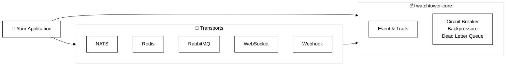

<div align="center">
  

  # /// WatchTower ///

  **A flexible, fault-tolerant notification library for Rust with pluggable transport backends**

  <!-- TODO: Uncomment when published -->
  <!-- [](https://crates.io/crates/watchtower) -->
  <!-- [](https://docs.rs/watchtower) -->
  [](LICENSE)

  ---
</div>

## Overview

Watchtower is a modular event notification system designed for distributed applications. It provides a unified API for publishing and subscribing to events across multiple transport protocols, with built-in support for fault tolerance, backpressure control, and observability.

## Architecture

Watchtower follows a layered architecture with pluggable transport backends and shared fault-tolerance components:

```
┌────────────────────────────────────────────────────────────────┐
│                          WATCHTOWER                            │
│                      (Application Layer)                       │
│                                                                │
│  • Unified Event API            • Transport Selection          │
│  • Publisher/Subscriber         • Configuration                │
│  • Application Logic            • Event Routing                │
└───────────────────────────────┬────────────────────────────────┘
                                │
┌───────────────────────────────▼────────────────────────────────┐
│                         CORE LAYER                             │
│                    (Shared Components)                         │
│                                                                │
│  • Event Abstraction            • Circuit Breaker              │
│  • Subscriber/Transport Traits  • Backpressure Controller      │
│  • Error Handling               • Dead Letter Queue            │
│  • Statistics & Health Checks   • Observability                │
└──────┬────────────────┬────────────┬────────────┬──────────────┘
       │                │            │            │
┌──────▼──────┐  ┌──────▼──────┐  ┌─▼─────┐  ┌──▼────┐  ┌───▼────┐
│    NATS     │  │    REDIS    │  │RABBIT │  │WEBSKT │  │WEBHOOK │
│  TRANSPORT  │  │  TRANSPORT  │  │  MQ   │  │TRANSP │  │TRANSP  │
│             │  │             │  │TRANSP │  │       │  │        │
│ • Subjects  │  │ • Streams   │  │• AMQP │  │• WS   │  │• HTTP  │
│ • Queues    │  │ • Groups    │  │• DLX  │  │• Bi-  │  │• HMAC  │
│ • Wildcard  │  │ • ACK/NACK  │  │• TTL  │  │  Dir  │  │• Retry │
└─────────────┘  └─────────────┘  └───────┘  └───────┘  └────────┘
       │                │            │            │           │
       └────────────────┴────────────┴────────────┴───────────┘
                                │
                    ┌───────────▼──────────┐
                    │  External Services   │
                    │  • NATS Server       │
                    │  • Redis Server      │
                    │  • RabbitMQ Broker   │
                    │  • WebSocket Server  │
                    │  • HTTP Endpoints    │
                    └──────────────────────┘
```

### Component Dependencies



### Architecture Layers

- **Application Level**: Your code using Watchtower's unified event API
- **Core Level**: Shared components used by all transports
  - `Event` - Event abstraction and metadata
  - `Subscriber/Transport` - Unified traits for all transports
  - `Circuit Breaker` - Fault tolerance and failure prevention
  - `Backpressure Controller` - Flow control and queue management
  - `Dead Letter Queue` - Failed event handling
- **Transport Level**: Protocol-specific implementations
  - Each transport implements core traits independently
  - All transports share the same fault-tolerance components
  - Pluggable architecture - use one or many transports

### Crate Organization

| Crate | Level | Purpose | Key Features |
|-------|-------|---------|--------------|
| **watchtower-core** | Core | Shared abstractions | • Event model<br>• Traits (Subscriber, Transport)<br>• Circuit Breaker<br>• Backpressure<br>• DLQ |
| **watchtower-nats** | Transport | NATS messaging | • Subject routing<br>• Queue groups<br>• Wildcard subscriptions |
| **watchtower-redis** | Transport | Redis Streams | • Consumer groups<br>• Stream persistence<br>• ACK/NACK |
| **watchtower-rabbitmq** | Transport | AMQP messaging | • Exchange routing<br>• Dead letter exchange<br>• Message TTL |
| **watchtower-websocket** | Transport | WebSocket | • Bidirectional streams<br>• Auto-reconnect<br>• In-memory DLQ |
| **watchtower-webhook** | Transport | HTTP notifications | • HMAC signatures<br>• Retry logic<br>• Per-URL circuit breakers |

## Features

- 🚀 **Multiple Transport Backends**: NATS, Redis Streams, RabbitMQ, WebSocket, Webhook
- 🔄 **Bidirectional Messaging**: Full publish/subscribe support for applicable transports
- 🛡️ **Fault Tolerance**: Circuit breaker pattern prevents cascading failures
- 📊 **Backpressure Control**: Configurable strategies (DropOldest, DropNewest, Block)
- 💀 **Dead Letter Queue**: Automatic handling of failed events
- ⚡ **Async/Await**: Built on Tokio for high-performance async operations
- 🔍 **Observability**: Real-time statistics and health checks

## Quick Start

Add Watchtower to your `Cargo.toml`:

```toml
[dependencies]
watchtower-core = "0.1"
watchtower-nats = "0.1"  # or redis, rabbitmq, websocket, webhook
```

### Basic Example

```rust
use std::sync::Arc;
use watchtower_core::prelude::*;
use watchtower_nats::prelude::*;

#[tokio::main]
async fn main() -> Result<(), Box<dyn std::error::Error>> {
    // Configure transport
    let config = NatsConfig::default();
    let mut subscriber = NatsSubscriber::new(config).await?;

    // Subscribe to events
    let handle = subscriber.subscribe(
        vec!["user.created".to_string()],
        Arc::new(|event| Box::pin(async move {
            println!("Received: {:?}", event);
            Ok(())
        }))
    ).await?;

    // Publish an event
    let event = Event::new(
        "user.created",
        serde_json::json!({"user_id": 123}),
    );
    subscriber.publish(event).await?;

    Ok(())
}
```

## Transport Comparison

| Feature | NATS | Redis | RabbitMQ | WebSocket | Webhook |
|---------|:----:|:-----:|:--------:|:---------:|:-------:|
| Publish | ✅ | ✅ | ✅ | ✅ | ✅ |
| Subscribe | ✅ | ✅ | ✅ | ✅ | ❌ |
| Persistence | ❌ | ✅ | ✅ | ❌ | ❌ |
| Queue Groups | ✅ | ✅ | ✅ | ❌ | ❌ |
| Circuit Breaker | ✅ | ✅ | ✅ | ✅ | ✅ |
| Dead Letter Queue | ✅ | ✅ | ✅ | ✅ | ✅ |

**Choose:**
- **NATS** for lightweight, high-performance pub/sub
- **Redis** for persistent streams with consumer groups
- **RabbitMQ** for advanced routing and guaranteed delivery
- **WebSocket** for real-time bidirectional communication
- **Webhook** for HTTP-based integrations

## Documentation

### Getting Started
- 📖 [Architecture](docs/ARCHITECTURE.md) - System design and components
- 🛡️ [Fault Tolerance](docs/FAULT_TOLERANCE.md) - Circuit breaker, DLQ, backpressure
- 🐳 [Development Setup](README.docker.md) - Docker, Makefile, examples

### Transport Guides
- [NATS](transport/nats/README.md) - Lightweight pub/sub messaging
- [Redis Streams](transport/redis/README.md) - Persistent stream processing
- [RabbitMQ](transport/rabbitmq/README.md) - Advanced message queuing
- [WebSocket](transport/websocket/README.md) - Real-time bidirectional communication
- [Webhook](transport/webhook/README.md) - HTTP-based notifications

## Development

### Start Services

```bash
make services-up    # Start NATS, Redis, RabbitMQ, etc.
```

### Run Examples

```bash
make example-nats
make example-redis
make example-rabbitmq
```

### Run Tests

```bash
make test           # Unit tests
make test-all       # All tests (requires services)
```

See [Development Setup](README.docker.md) for complete guide.

## Examples

Check the [examples](examples/) directory:
- `prelude_usage.rs` - Using prelude modules
- `nats_pubsub.rs` - Basic NATS publish/subscribe
- `redis_streams.rs` - Redis Streams with consumer groups
- `rabbitmq_dlx.rs` - RabbitMQ with dead letter exchange
- `websocket_bidirectional.rs` - WebSocket bidirectional messaging
- `webhook_signatures.rs` - Webhook with HMAC signatures

## Planned Features

### Reliability & Performance
- **Graceful shutdown** - Wait for in-flight events before terminating
- **Persistent queues** - Disk-backed event storage for durability
- **Batch operations** - Group events for improved throughput
- **Priority queues** - Process critical events first
- **Event replay** - Reprocess events from history

### Observability
- **Prometheus metrics** - Events count, latency, errors, queue sizes
- **OpenTelemetry tracing** - Distributed trace propagation
- **Health checks** - Transport status monitoring
- **Structured logging** - Rich context in logs

### Functionality
- **Content-based filtering** - Filter events by payload predicates
- **Event middleware** - Transform events before delivery
- **Builder pattern** - Ergonomic configuration API
- **Delivery semantics** - Configurable guarantees (at-most-once, at-least-once, exactly-once)
- **Idempotency keys** - Prevent duplicate processing

### Transport Enhancements
- **NATS JetStream** - Persistence and replay capabilities
- **Redis Cluster** - Distributed deployment support
- **RabbitMQ Quorum Queues** - Enhanced reliability
- **Webhook rate limiting** - Protect external endpoints
- **WebSocket compression** - Reduce bandwidth usage

### Security
- **TLS/mTLS** - Encrypted transport connections
- **Authentication** - JWT, certificates, token-based auth
- **Secret rotation** - Vault/AWS Secrets Manager integration
- **Audit logging** - Track all operations

See [ARCHITECTURE_ISSUES.md](ARCHITECTURE_ISSUES.md) for detailed analysis and implementation plans.

## Contributing

Contributions are welcome! Please read our [Contributing Guide](CONTRIBUTING.md) for details.

## License

This project is licensed under the MIT License - see the [LICENSE](LICENSE) file for details.

## Acknowledgments

- Inspired by [Storehaus](https://github.com/twitter/storehaus) architecture
- Built with [Tokio](https://tokio.rs/) async runtime
- Uses [async-nats](https://github.com/nats-io/nats.rs), [redis-rs](https://github.com/redis-rs/redis-rs), [lapin](https://github.com/amqp-rs/lapin)
- Icon: <a href="https://www.flaticon.com/free-icons/watchtower" title="watchtower icons">Watchtower icon created by Freepik - Flaticon</a>

---

<div align="center">
  <sub>Built with ❤️ for the Rust community</sub>
</div>
